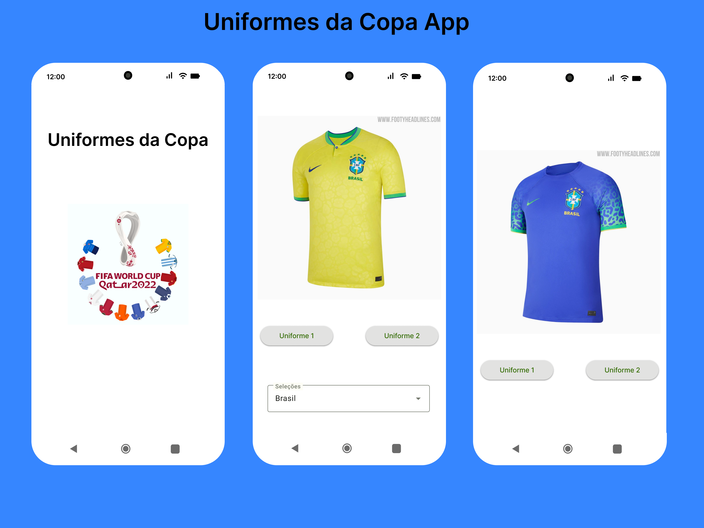

# 🇧🇷 👕 Uniformes da Copa App 👕 🇧🇷

 

## 📡 Tecnologias Usadas

- Kotlin
- ViewBinding
- Fragments
- Retrofit
- Glide
- Material Design
- Figma Design

## 🚀 Como Executar 
> basta clonar o repositório, abrir com o android studio sincronizar 
> para baixar as dependências do projeto e executar no emulador ou aparelho

 
 